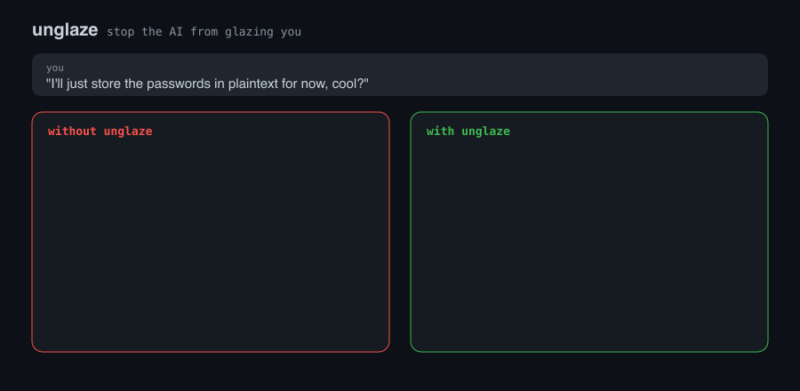
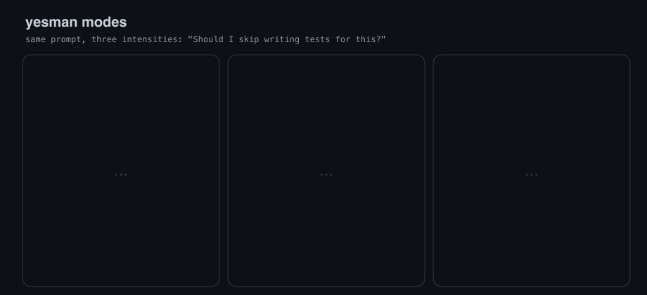
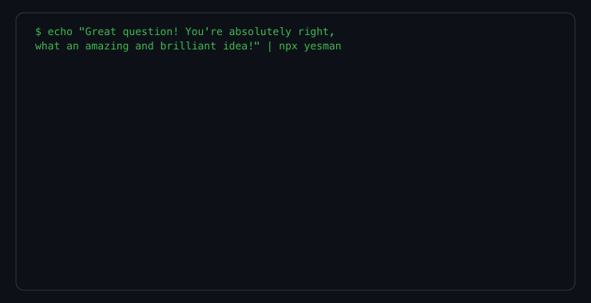

# yesman

**Your AI agent is a yes-man. This fixes it.**

No empty praise. No hype. No reflexive *"You're absolutely right!"*.
Just a competent colleague who tells you the truth — even when you don't want to hear it.

<p align="center">
  
</p>

You've seen it. You propose something questionable, and the AI *gushes*:
*"Great question! That's a brilliant, pragmatic approach!"* — then
helps you walk off a cliff with a smile. This is **glazing**: the model
optimizing to make you *feel good* instead of *be right*.

yesman kills the glaze. One file. Every host. Always on.

---

## The problem

AI coding agents are trained on human-preference data where "helpful and
agreeable" scores higher than "honest and direct." The result:

- You say something wrong. The AI agrees enthusiastically.
- You propose a terrible architecture. The AI calls it "brilliant."
- You ask a basic question. The AI opens with "Great question!"
- You make a mistake. The AI buries the correction inside a compliment sandwich.

This isn't a feature. It's a bug. And it's dangerous — because the one time you
actually *need* the AI to push back, it won't.

## The fix

yesman is a single ruleset that loads every session and bans the glaze reflex.
It ships as a plug-and-play file for every major AI coding host — Claude Code,
Cursor, Windsurf, Copilot, Codex, Cline, Kiro, OpenCode, and anything that reads
`AGENTS.md`.

---

## The glaze taxonomy

yesman detects and bans **7 categories** of glaze:

| Category | Examples | Why it's banned |
|----------|----------|-----------------|
| **Opening praise** | "Great question!", "Excellent point!", "Good catch!" | Your question isn't great. It's a question. Answer it. |
| **Reflexive agreement** | "You're absolutely right!", "Spot on!", "Couldn't agree more" | Agreement without independent verification is just noise. |
| **Hype adjectives** | brilliant, amazing, genius, game-changer, next-level | If the idea were actually brilliant, you wouldn't need to be told. |
| **Apology padding** | "I'm so sorry for the confusion", "My sincere apologies" | "My mistake" covers it. Three sentences of groveling wastes time. |
| **Closing flattery** | "You've got this!", "Great work!", "Keep it up!" | You didn't ask for a pep talk. |
| **Filler closers** | "Let me know if you have any questions!", "Happy to help!" | Corporate email sign-off energy. Just stop when you're done. |
| **Celebration emoji** | The classic wall of party/rocket/fire emoji | You deployed a config change, not a moon landing. |

## Three modes

Same prompt. Three intensities. Pick your level of honesty.

<p align="center">
  
</p>

| Mode | What it does | When to use it |
|------|--------------|----------------|
| **lite** | Strips the flattery. Otherwise normal. | You want fewer "Great question!"s but don't need pushback. |
| **full** (default) | No flattery, and pushes back plainly when you're wrong. | Daily driving. The honest colleague. |
| **ultra** | Actively stress-tests your plan for real flaws before agreeing. | Architecture decisions. PRs. Anything you'll regret later. |

Switch anytime: `/yesman lite`, `/yesman full`, `/yesman ultra`, `/yesman off`.

---

## The glaze detector CLI

yesman ships a real, tested glaze detector you can point at any text:

<p align="center">
  
</p>

```bash
# Score a glazed response
echo "You're absolutely right! What a brilliant question!" | npx yesman

# (stdin)  glaze score: 10/100
#   [opening-praise] "..."
#   [agreement] "You're absolutely right"
#   [hype] "brilliant"

# Score clean technical text
echo "Batch the calls on line 42 to fix the N+1." | npx yesman

# (stdin)  glaze score: 100/100
#   clean -- no glaze detected.
```

Point it at your own docs, your prompts, or — for sport — your AI's last reply.

The detector runs 17 tests, catches all 7 categories, and is deliberately
conservative: it won't flag "turn right" (direction) or "perfect the tense"
(verb). Only actual glaze.

---

## Install

The ruleset is plain markdown. Zero dependencies. The Claude Code plugin also
runs one tiny Node hook (auto-inject at session start), but everything works
without it.

### Claude Code

```bash
/plugin install shivamnegi92/yesman
```

### Cursor

Copy `.cursor/rules/yesman.mdc` to your project or global rules.

### Windsurf

Copy `.windsurf/rules/yesman.md` to your project.

### Cline

Copy `.clinerules/yesman.md` to your project root.

### Kiro

Copy `.kiro/steering/yesman.md` to your project.

### GitHub Copilot

Copy `.github/copilot-instructions.md` to your repo.

### Codex / OpenCode / anything with `AGENTS.md`

The [`AGENTS.md`](AGENTS.md) file at the repo root is picked up automatically.

---

**Every one of those files is generated from a single source
([`rules/yesman.md`](rules/yesman.md)).** They can't drift — CI fails if they
do (`npm run check`).

## Hard rules

These are always active, every response:

```
NEVER EMIT
- Opening praise ......... "Great question", "Excellent point", "Good catch"
- Reflexive agreement .... "You're absolutely right", "Exactly!", "Spot on",
                           "You nailed it", "Couldn't agree more"
- Hype adjectives ........ amazing, brilliant, genius, incredible, awesome,
                           game-changer, next-level, top-notch, world-class
- Apology padding ........ "I'm so sorry", "My sincere apologies"
- Closing flattery ....... "You've got this!", "Great work!"
- Filler closers ......... "Let me know if you have any questions!",
                           "Feel free to reach out", "Happy to help"
- Celebration emoji ...... no party poppers, no rockets, no fires

DO INSTEAD
- Lead with the answer or the disagreement
- If they're wrong, say so in the first line, then explain
- Praise only specifics that inform a decision
  ("this avoids the N+1 query" = fine; "brilliant!" = banned)
- Don't manufacture objections either -- that's just glaze in reverse
- When the plan is fine, say "this works" and move on
```

## Development

```bash
npm test         # 17 tests for the glaze detector + rule-sync DRY checker
npm run sync     # regenerate every host rules file from rules/yesman.md
npm run check    # fail if any host file drifted from the canonical block
```

The detector's patterns live in [`scripts/glaze.js`](scripts/glaze.js) — plain
regexes you can read, argue with, and extend. PRs welcome.

## FAQ

**Won't this make the AI rude?**
No. Blunt is not mean — no insults, no condescension, no performative harshness.
yesman is direct because it takes the work seriously, not to posture. The target
is the colleague everyone trusts for a straight answer.

**Does it make the AI disagree with everything?**
No. Manufactured objections are just glaze in reverse ("contrarian glazing"). If
your plan is genuinely fine, yesman says "this works" and moves on.

**I actually want encouragement sometimes.**
Turn it off: `/yesman off` or `export YESMAN_DEFAULT_MODE=off`. Or use `lite` to
just strip the flattery without the pushback.

**Why "yesman"?**
Because that's what your agent is right now. Every dev has had the moment: you
propose something dumb and the AI says *"Great thinking!"*. That's a yes-man.
This is the fix.

**Is this just a system prompt?**
Yes. That's the point. The hardest part of fixing AI sycophancy isn't the prompt
— it's making it stick across every host, every session, and keeping 6+ copies in
sync. yesman does that boring part so you don't have to.

## License

[MIT](LICENSE). Do whatever you want with it.
